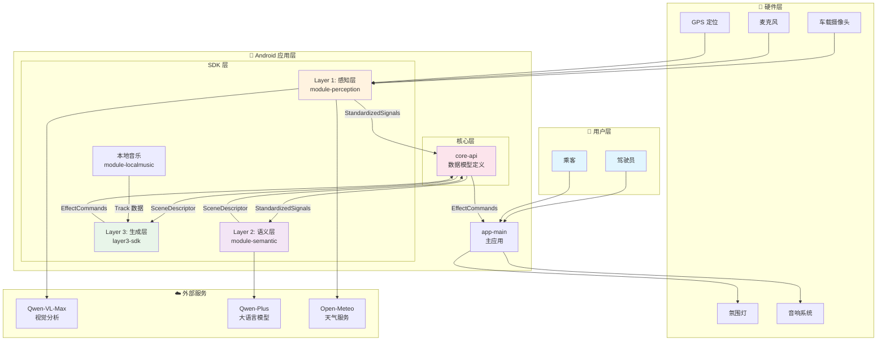
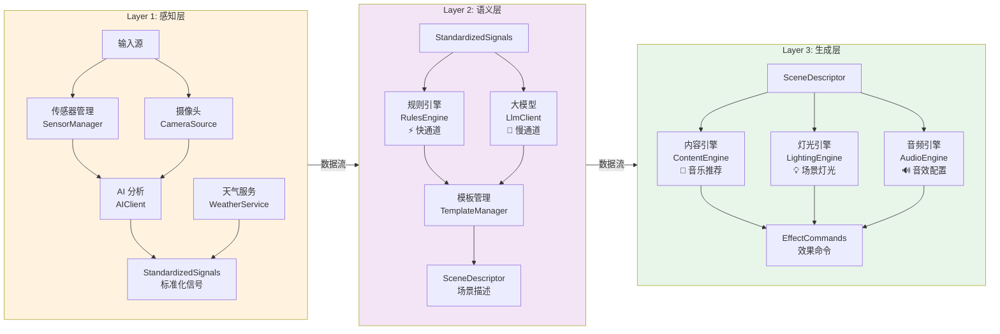
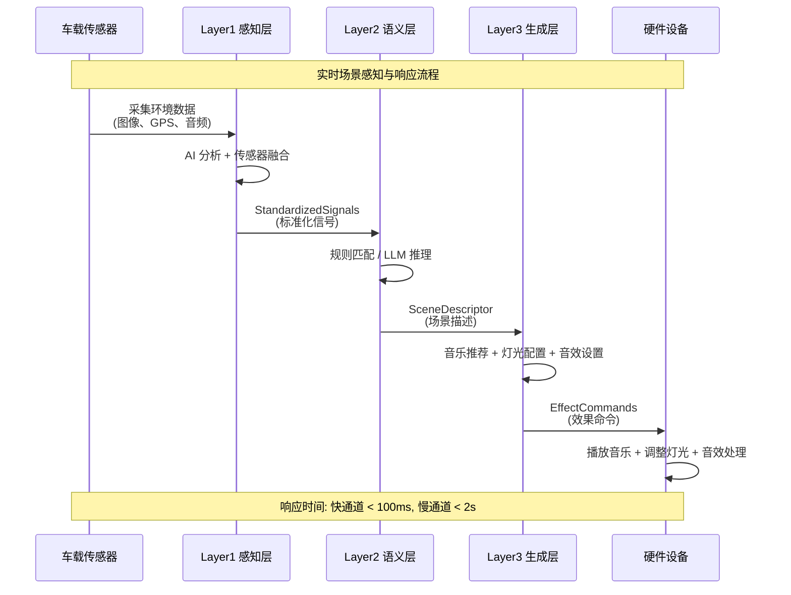
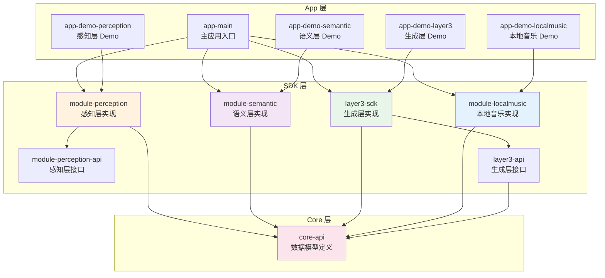
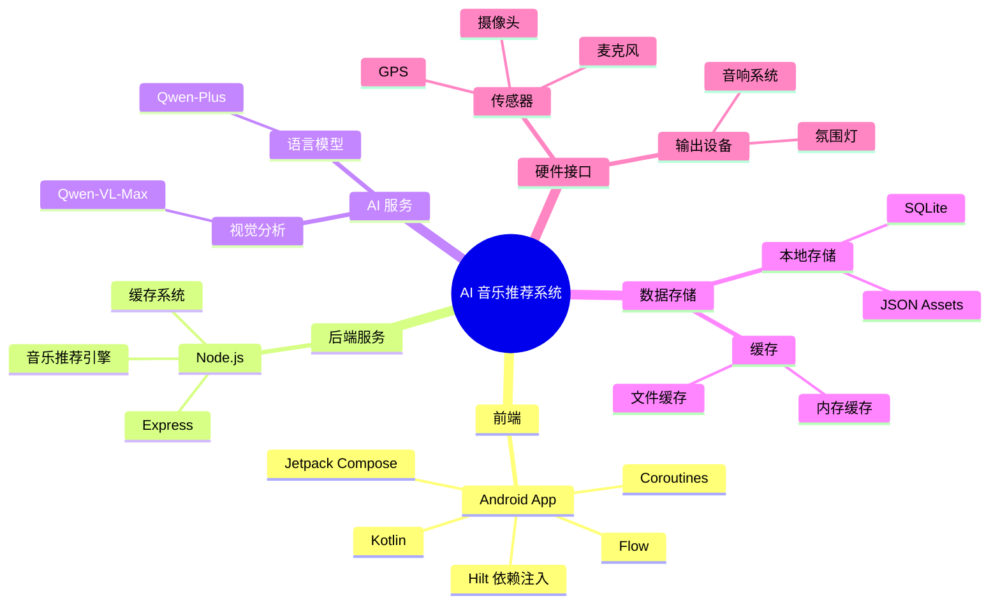
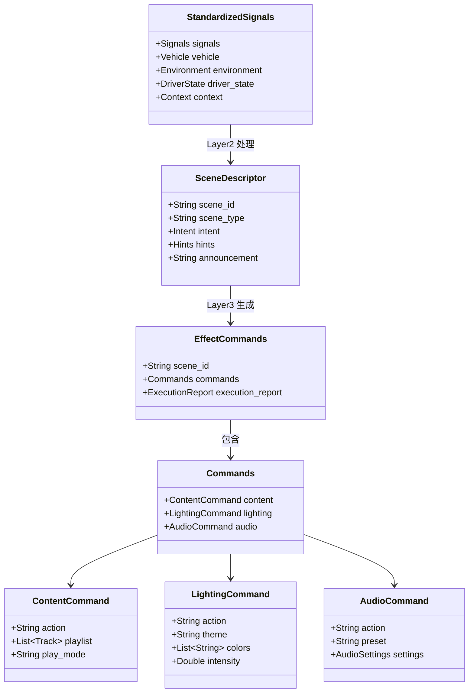
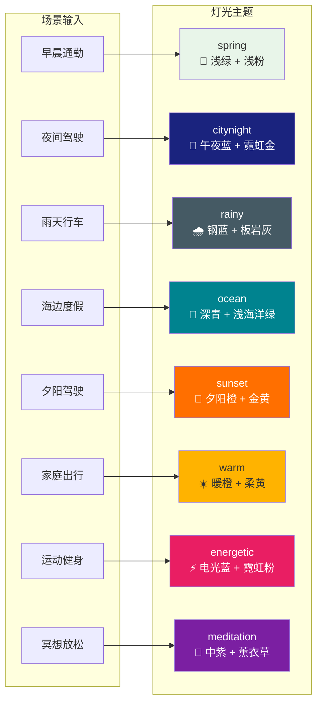
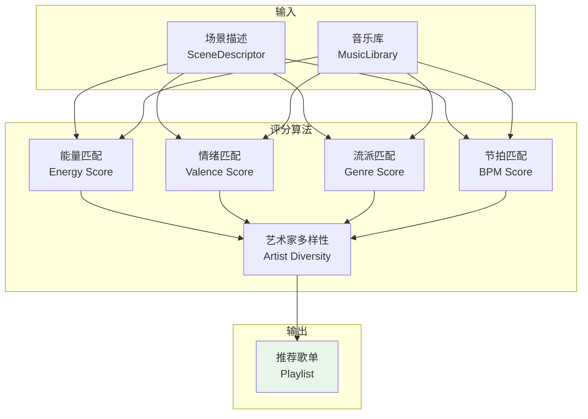
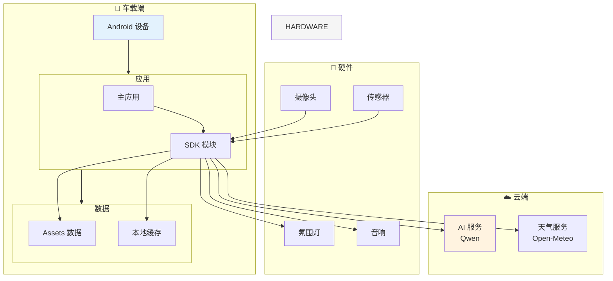

# AI 音乐推荐系统 - 技术架构文档

## 一、系统整体架构

---

## 二、三层架构详解

---

## 三、数据流架构

---

## 四、Android 模块架构

---

## 五、技术栈

---

## 六、核心数据模型

---

## 七、场景化灯光主题

---

## 八、音乐推荐算法

---

## 九、系统部署架构

---

## 十、关键性能指标

| 指标 | 目标值 | 说明 |
|------|--------|------|
| 快通道响应 | < 100ms | 规则匹配场景 |
| 慢通道响应 | < 2s | LLM 推理场景 |
| 缓存命中率 | > 90% | 歌单缓存 |
| 内存占用 | < 200MB | 应用运行时 |
| 启动时间 | < 3s | 冷启动 |
| 音乐推荐准确率 | > 85% | 用户满意度 |

---

## 十一、开发状态

| 模块 | 状态 | 进度 |
|------|------|------|
| core-api | ✅ 完成 | 100% |
| module-perception | ✅ 完成 | 100% |
| module-semantic | ✅ 完成 | 100% |
| layer3-sdk | ✅ 完成 | 100% |
| module-localmusic | ✅ 完成 | 100% |
| app-main | ✅ 完成 | 100% |
| app-demo-* | ✅ 完成 | 100% |

---

## 十二、联系方式

- **项目仓库**: GitHub - ai-music-cowork
- **文档位置**: `/docs` 目录
- **开发状态**: `Android_app/DEVELOPMENT_STATUS.md`
