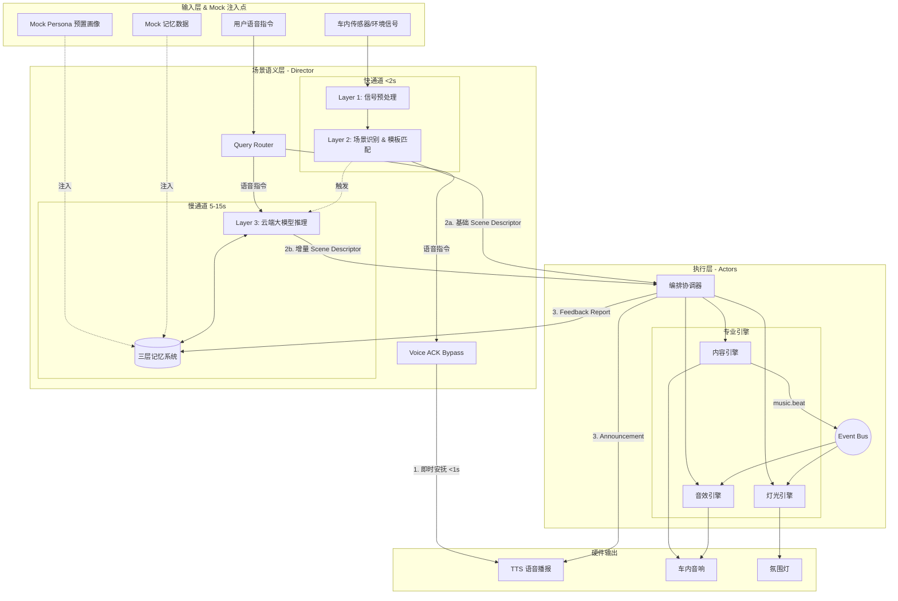

# 车载座舱 AI 娱乐融合方案 — 研发实施计划

## 目录
- [1. 研发工作安排](#1-研发工作安排)
- [2. 优先级](#2-优先级)
- [3. 技术架构](#3-技术架构)
- [4. 代码依赖](#4-代码依赖)
- [5. 质量验证方法](#5-质量验证方法)
- [6. 研发难点和解决方案](#6-研发难点和解决方案)
- [7. 场景化测试路径与预期效果](#7-场景化测试路径与预期效果-scenario-based-testing-paths)
- [8. 全链路技术方案评估与选型](#8-全链路技术方案评估与选型)
  - [8.1 平台基线与硬件约束分析](#81-平台基线与硬件约束分析)
  - [8.2 语义层技术方案评估 (Layer 1-3)](#82-语义层技术方案评估-layer-1-3)
  - [8.3 执行层技术方案评估](#83-执行层技术方案评估)
  - [8.4 支撑系统技术方案](#84-支撑系统技术方案)
  - [8.5 核心风险与应对策略 (Risk Management)](#85-核心风险与应对策略-risk-management)
  - [8.6 总结与下一步建议](#86-总结与下一步建议)

---

基于《车载座舱 AI 娱乐融合方案 — 技术规范文档 V2.2》，为确保项目高质量、按时交付，特制定本研发实施计划。

## 1. 研发工作安排

项目整体分为四个阶段，采用“Mock 驱动 + 接口先行”的并行开发策略，总周期预计 18 周。详细任务拆解请参考 [tasks.md](tasks.md)。

*   **Phase 0：接口定义与准备（第 1-2 周）**
    *   定义并冻结 Scene Descriptor JSON Schema (V2.0)、Feedback Report 结构及 ACK 消息结构。
    *   **构建 Mock 数据中心**：针对 Demo 阶段数据有限的问题，预置 3-5 个典型用户画像（Persona，如“疲惫的通勤者”、“带娃出行的家长”），并为每个画像 Mock 对应的短期/中期记忆数据（如偏好流派、历史干预记录）。
    *   各团队（语义层、内容、灯光、音效）基于 Mock 数据搭建独立开发环境。
*   **Phase 1：核心链路开发（第 3-6 周）**
    *   **语义层**：完成 Layer 1（信号预处理）、Layer 2（场景识别）及本地快通道模板库；实现 Query Router 与 ACK 生成逻辑。
    *   **执行层**：搭建编排协调器，完成内容、灯光、音效引擎的基础版本。
    *   **里程碑 M2**：快通道 Demo 跑通，实现上车 2 秒内模板响应及用户语音 1 秒内 ACK。
*   **Phase 2：智能化升级（第 7-10 周）**
    *   **语义层**：接入云端大模型（Layer 3），实现慢通道精细化推理与增量更新逻辑。
    *   **执行层**：完善引擎自主决策逻辑，处理 Hints 采纳与硬约束（Constraints）；打通 Event Bus 实现引擎间实时协作。
    *   **里程碑 M3**：智能化 Demo 跑通，快慢双通道融合，慢通道结果平滑替换模板。
*   **Phase 3：体验打磨（第 11-14 周）**
    *   开发短期与中期记忆系统，实现个性化偏好记录。
    *   落地质量评估闭环（规则校验 + 行为反馈收集）。
    *   优化各类场景过渡策略（渐变、事件、紧急），调优 ACK 话术模板。
    *   **里程碑 M4**：体验版交付，连续使用后推荐精准度显著提升。
*   **Phase 4：规模化与发布（第 15-18 周）**
    *   场景模板扩充至 100 个，完善长期用户画像与旅程回忆功能。
    *   **内部 Persona A/B 测试**：针对 Demo 阶段难以获取大规模真实用户的问题，基于预置的 Mock Persona 进行内部对比测试（如对比不同 Prompt 策略下“疲惫通勤者”的满意度评分）。
    *   **里程碑 M5**：发布版交付，通过车规级测试。

## 2. 优先级

*   **P0（核心基建与底线体验）**：Scene Descriptor 接口契约、Layer 1/2 信号处理、快通道模板响应（<2秒）、基础声光电联动、自动化规则校验（安全底线）。
*   **P1（核心亮点与架构关键）**：Voice ACK Bypass（语音即时应答旁路）、双速架构（快慢通道融合）、Layer 3 大模型推理、Event Bus 引擎同步。
*   **P2（体验深化与闭环）**：三层记忆系统（短/中/长期）、复杂场景过渡编排（Transition）、语义一致性评分与用户反馈闭环。
*   **P3（增值与扩展）**：旅程回忆卡片生成、基于 Mock Persona 的内部 A/B 测试框架搭建、场景模板从 10 个扩充至 100 个。

## 3. 技术架构

系统整体分为**场景语义层**（负责理解与决策）和**执行层**（负责专业表现），核心架构设计包含以下三大关键机制：

### 3.0 整体架构图 (Architecture Overview)

以下架构图展示了双速架构、3段式握手、记忆模块以及 Mock 数据注入点的整体流转关系：

### 3.1 双速架构 (Dual-speed Architecture)
为解决大模型推理延迟与车载场景极速响应要求的矛盾，采用快慢双通道设计：
*   **快通道（本地）**：基于 Layer 2 的轻量级模型与预置模板库，在上车或场景突变时，**<2秒**内下发基础 Scene Descriptor，确保用户立刻获得声光响应。
*   **慢通道（云端）**：快通道启动后，Layer 3 大模型在后台进行精细化推理（耗时 5-15 秒），生成包含个性化 Hints 和精细 Energy Curve 的描述，通过增量 Diff 渐变更新当前场景，实现“越来越懂我”的体验。

### 3.2 Voice ACK Bypass (语音即时应答旁路)
针对用户主动 Query 场景，消除等待大模型推理的“黑箱焦虑”：
*   在 Layer 2 之前设立独立的 Query Router。
*   当识别到用户语音指令后，**不等待 Layer 3 推理**，直接在 **<1秒** 内生成 ACK 消息（如“好主意，让我想想怎么编排”）并发送至 TTS 播报。
*   该旁路通道与后续的 Announcement（场景解释）职责分离，确保交互的即时性。

### 3.3 三阶段握手 (3-stage Handshake)
系统与用户的交互及内部流转被设计为严谨的三阶段握手闭环：
1.  **第一阶段（即时确认 ACK）**：用户发起请求，系统通过 Voice ACK Bypass 立即回应（<1秒），建立“已听懂”的预期。
2.  **第二阶段（意图下发与执行）**：Layer 3 完成推理，下发结构化的 Scene Descriptor。编排协调器解析 Intent（硬约束）与 Hints（软建议），各专业引擎（内容、灯光、音效）自主决策并开始平滑过渡。
3.  **第三阶段（解释与反馈闭环）**：执行层通过 TTS 播报 Announcement 解释场景变更原因，同时向语义层回传 Feedback Report（包含参数采纳情况与用户干预行为），完成单次交互闭环并更新记忆系统。

## 4. 代码依赖

*   **内部模块依赖**：
    *   **语义层输入依赖**：强依赖车内硬件信号（OMS 摄像头、Mic 音频流）及车机系统 API（时间、天气、导航行程、车外摄像头识别结果）。
    *   **执行层输入依赖**：强依赖语义层生成的 Scene Descriptor JSON。
    *   **引擎间通信依赖**：灯光引擎与音效引擎强依赖内容引擎通过 Event Bus 广播的 `music.beat`（节拍）和 `music.track_changed`（切歌）事件，以实现声光电毫秒级同步。
*   **外部/第三方依赖**：
    *   **云端 LLM 服务**：用于 Layer 3 的复杂场景推理与意图生成。
    *   **语音交互基建**：ASR（语音识别，需支持流式输出以降低延迟）与 TTS（语音合成，需支持多音色如 warm_female）。
    *   **本地轻量模型**：用于 Layer 2 的场景向量分类与 OMS 面部/情绪识别算法库。

## 5. 质量验证方法

构建三层质量评估闭环，确保系统既安全可靠又持续进化：

1.  **第一层：自动化规则校验（实时底线）**
    *   **方法**：在 Scene Descriptor 下发前进行 100% 拦截校验。
    *   **指标**：儿童模式内容分级必须为 G、音量不超过安全阈值、用户硬约束（Overrides）必须满足、ACK 必须触发。不通过则强制回退至安全模板。
2.  **第二层：语义一致性评分（离线批量）**
    *   **方法**：构建包含 500-1000 条数据的评估集，由产品专家对“输入信号 -> Descriptor 输出”进行打分（1-5分）。
    *   **指标**：情绪匹配度（30%）、能量匹配度（20%）、约束满足度（25%）、叙事连贯性（15%）、多维协调性（10%）。后期训练自动化打分模型用于线上监控。
3.  **第三层：用户行为反馈（线上长期）**
    *   **方法**：通过 Feedback Report 收集用户的隐式与显式反馈。
    *   **指标**：负面信号（歌曲跳过率、手动调光/调音率、语音打断）与正面信号（完整播放率、收藏场景）。结合 A/B 测试框架（如对比不同 Hints 详细度），将质量分反哺给 Layer 3 Prompt 和 Layer 2 模板库。

## 6. 研发难点和解决方案

*   **难点一：云端大模型延迟（5-15s）导致用户体验断层**
    *   **解决方案**：全面落实**双速架构**与 **Voice ACK Bypass**。上车/突变场景用本地模板秒级响应；语音指令场景用 ACK 旁路秒级安抚；大模型结果仅作增量平滑替换，掩盖计算延迟。
*   **难点二：多模态信号置信度波动导致“智障”误判**
    *   **解决方案**：建立严格的**信号置信度体系与降级链**。低置信度信号（如情绪推断）大幅降权；当综合场景置信度 < 0.5 时，系统放弃激进推理，回退到基于“时间+天气”的安全模板，遵循“宁可少判断，不可误判断”原则。
*   **难点三：AI 幻觉导致硬件控制异常或违背安全底线**
    *   **解决方案**：引入 **Scene Descriptor 契约**与**第一层自动化规则校验**。大模型只输出语义 Intent（如“温馨”），不直接输出硬件参数（如 RGB 值）；所有输出必须经过规则引擎的底线校验（如儿童模式强制过滤），确保 100% 安全。
*   **难点四：声光电多引擎协同的同步性与过渡自然度**
    *   **解决方案**：摒弃中央集权控制，采用**“导演-演员”模式 + Event Bus**。语义层统一下发 `energy_curve` 规划全局叙事节奏；执行层各引擎自主决策，并通过 Event Bus 监听音乐节拍（Beat）实现毫秒级硬件同步；过渡策略由 `transition` 字段统一指挥，确保优雅渐变。

## 7. 场景化测试路径与预期效果 (Scenario-based Testing Paths)

为了在 Demo 阶段直观验证双速架构、ACK 机制及多模态融合的效果，特规划以下 3 个核心场景的测试路径与预期验收标准（参考 `spec-all.md`）：

### 7.1 场景一：深夜雨天独自通勤（验证快慢通道平滑交接）
*   **预置画像 (Persona)**：疲惫的通勤者（偏好爵士乐，不喜欢流行乐，通勤偏好安静）。
*   **输入信号 (Mock)**：时间=22:30，天气=雨，OMS=1人成人，Mic=静默。
*   **测试路径**：
    1.  **T+0s**：注入 Mock 信号，触发 Layer 1 & Layer 2，匹配到 `melancholic_calm` 场景簇。
    2.  **T+1.5s (快通道)**：编排协调器收到基础模板，各引擎开始执行。
    3.  **T+2s**：触发 Layer 3 慢通道推理。
    4.  **T+10s (慢通道)**：Layer 3 返回结合了 Persona 的个性化 Descriptor，执行增量更新。
*   **预期效果**：
    *   **< 2秒**：TTS 播报“外面在下雨，为你准备了安静的音乐”；灯光渐变为暖琥珀色（呼吸动效）；播放低能量音乐。
    *   **5-15秒后**：音乐列表悄然更新为用户偏好的爵士乐，能量曲线变得更细腻（如分 5 段渐变），用户感知到体验的“无缝升级”。

### 7.2 场景二：儿童上车 + 创意语音请求（验证硬约束与 Voice ACK）
*   **预置画像 (Persona)**：带娃出行的家长。
*   **输入信号 (Mock)**：1. OMS 检测到后排儿童上车；2. 用户语音输入：“给我一个海边度假的感觉”。
*   **测试路径**：
    1.  **T+0s (事件触发)**：儿童上车，触发快通道切换至 `family_joy` 模板。
    2.  **T+30s (语音触发)**：注入用户创意 Query。
    3.  **T+30.5s (ACK 旁路)**：Query Router 拦截，识别为创意型，直接触发 TTS。
    4.  **T+31s**：触发 Layer 3 推理（携带“海边度假”意图与“儿童在车上”的硬约束）。
    5.  **T+38s (慢通道)**：Layer 3 返回新 Descriptor，编排协调器执行。
*   **预期效果**：
    *   **儿童上车 < 2秒**：自动切换为儿童友好歌单（Content Rating 强制为 G），灯光变柔和粉色。
    *   **语音输入 < 1秒**：TTS 即时安抚：“好主意，让我想想怎么编排”（消除等待焦虑）。
    *   **语音输入 5-15秒后**：TTS 播报“为你们切换到海边度假模式...”；音乐切换为轻快 Bossa Nova（仍保持儿童适宜的硬约束）；灯光渐变为海洋蓝+日落橘。

### 7.3 场景三：疲劳驾驶紧急干预（验证紧急场景防抖与越权控制）
*   **预置画像 (Persona)**：长途驾驶者。
*   **输入信号 (Mock)**：OMS 检测到频繁揉眼、闭眼时间变长，导航显示行程已达 2 小时。
*   **测试路径**：
    1.  **T+0s**：Layer 1 识别高疲劳度，Layer 2 判定为紧急场景 (critical change)。
    2.  **T+1s (快通道紧急响应)**：匹配 `fatigue_alert` 模板，跳过常规的防抖和 Announcement 等待，直接下发硬件指令。
    3.  **T+10s (慢通道)**：Layer 3 后台生成更精细的提神方案。
*   **预期效果**：
    *   **< 2秒 (绝对优先)**：灯光立即调至最高亮度（冷白/亮蓝）；音乐瞬间切换为高能量/强节奏曲目；音效增强低音。TTS 同步强提醒：“检测到你有点疲劳，为你切换到提神模式，建议找个服务区休息一下”。

---

## 8. 全链路技术方案评估与选型

基于《技术规范文档 V2.2》(spec.md) 的产品定义与架构设计，结合高通 SA8295P 平台与 Android 14 Automotive 环境，本报告对全链路技术方案进行选型、架构、可行性及核心风险评估。

### 8.1 平台基线与硬件约束分析

#### 8.1.1 SA8295P 芯片能力边界
SA8295P 是当前量产车规级旗舰芯片，其硬件能力决定了本项目的技术天花板：

| 维度 | 参数 | 对本项目的技术影响 |
|------|------|------------------|
| **NPU/DSP** | Hexagon DSP，30 TOPS | **核心资源**：端侧模型推理的唯一加速通道。需与系统级服务（如OMS人脸识别）抢占算力。 |
| **内存** | 24GB LPDDR5（系统共享） | **最大瓶颈**：Android系统+HMI+导航等预计占用12-16GB，留给本项目的可用预算约 **4-6GB**。 |
| **CPU** | Kryo 8核 (4大+4小) | 足够支撑多引擎并行、规则引擎与事件总线。 |
| **多媒体** | 硬件音视频编解码 | ExoPlayer 可利用硬件解码，降低 CPU 占用。 |

#### 8.1.2 软件平台约束 (Android 14 Automotive)
| 维度 | 约束 | 技术选型影响 |
|------|------|------------|
| **虚拟化** | QNX Hypervisor + Android | Android 运行在虚拟机中，硬件访问需通过 VHAL（车辆硬件抽象层）。 |
| **车辆属性** | CarPropertyManager | 灯光控制的标准通道，但氛围灯是否暴露为标准属性取决于车厂实现。 |
| **音频框架** | Car Audio Service | 音频焦点管理、多区域音频由系统框架控制，需严格遵守焦点申请机制。 |

#### 8.1.3 内存预算估算（可行性验证）
| 组件 | 预估内存占用 | 评估结论 |
|------|------------|---------|
| 端侧 LLM (Qwen-1.5B Q4) | ~1.2GB | 权重+KV Cache+运行时 |
| 音乐播放缓冲 (ExoPlayer) | ~50-100MB | 流式播放+预加载 |
| TTS 引擎 (讯飞离线) | ~80-150MB | 离线模型+运行时 |
| 各引擎运行时+规则引擎 | ~100-150MB | 服务进程 |
| **合计** | **~1.5-1.7GB** | **在 4-6GB 预算内，可行但偏紧。** 建议 MVP 阶段采用 Qwen-0.5B（~400MB）以降低风险。 |

### 8.2 语义层技术方案评估 (Layer 1-3)

语义层是系统的"大脑"，负责多模态信号融合与 Scene Descriptor 生成。

#### 8.2.1 Layer 1：信号预处理层
* **定位**：纯规则引擎，实时（<100ms），负责信号标准化与降级。
* **技术选型**：**纯 Kotlin 规则引擎**。
* **可行性**：极高。不涉及复杂算法，仅做数据映射和置信度加权。
* **架构设计**：采用责任链模式（Chain of Responsibility），每个信号源对应一个 Processor，便于后续增删传感器。

#### 8.2.2 Layer 2：场景识别层（快通道）
* **定位**：本地轻量级计算，200ms-1秒，负责场景分类与变化检测。
* **技术选型**：
  * **方案 A（推荐）**：**加权规则匹配树**。基于 Layer 1 的标准化输出，计算与预定义场景簇（Scene Cluster）的距离。
  * **方案 B（备选）**：**TensorFlow Lite 极小分类模型**。
* **可行性**：极高。方案 A 内存占用极小（<10MB），响应速度极快（<50ms），完全满足"上车 2 秒内响应"的体验要求。

#### 8.2.3 Layer 3：场景推理层（慢通道）
* **定位**：大模型推理，5-15秒，负责生成个性化 Scene Descriptor。
* **技术选型（云端主用）**：**阿里云通义千问 Qwen-Plus API**。
  * *理由*：近期 API 价格大幅下调（0.8元/百万token），中文理解能力顶尖，JSON 格式化输出稳定。
* **技术选型（端侧备用/无网环境）**：**Qwen2.5-0.5B-Instruct (GGUF 格式) + llama.cpp**。
  * *理由*：0.5B 模型量化后仅需 ~400MB 内存，llama.cpp 提供优秀的 C++ 跨平台推理能力。
  * *部署方案*：通过 JNI 封装 llama.cpp，利用高通 QNN SDK (Qualcomm AI Engine Direct) 将计算图 offload 到 Hexagon DSP 加速。
* **可行性**：中等偏上。云端方案成熟；端侧方案需攻克 QNN SDK 与 llama.cpp 的适配，是核心技术难点。

#### 8.2.4 Query Router 与 ACK 机制
* **定位**：用户语音指令的即时响应（<1秒）。
* **技术选型**：**本地意图分类器（正则表达式/轻量 NLP 模型）**。
* **可行性**：高。不依赖 LLM，直接匹配预设 ACK 模板，通过独立通道发送至 TTS。

### 8.3 执行层技术方案评估

执行层是"专业演员"，负责将 Scene Descriptor 转化为声光电的物理表现。

#### 8.3.1 编排协调器 (Orchestrator)
* **技术选型**：**Kotlin Coroutines + StateFlow**。
* **架构设计**：基于状态机（State Machine）管理过渡时序（Idle -> Preparing -> Playing -> Transitioning）。
* **可行性**：高。Kotlin 协程非常适合处理这种多任务并发与时序控制。

#### 8.3.2 内容引擎 (Team B)
* **技术选型**：**Google ExoPlayer (AndroidX Media3)**。
* **架构设计**：
  * 播放控制：MediaSession 统一管理，处理系统音频焦点（Audio Focus）。
  * 歌单编排：本地 SQLite 维护曲库元数据（Tags, BPM, Energy），基于 SQL 查询拟合 energy_curve。
* **可行性**：极高。ExoPlayer 是 Android 平台最成熟的流媒体框架，支持无缝切歌（Gapless Playback）和淡入淡出（Crossfade）扩展。

#### 8.3.3 灯光引擎 (Team C)
* **技术选型**：**Android CarPropertyManager API**。
* **架构设计**：
  * 语义映射：内部维护 `ColorPalette` 和 `RhythmPattern` 枚举。
  * 动效生成：使用 Android `ValueAnimator` 生成随时间变化的亮度/颜色值，高频（如 30fps）写入 VHAL。
* **可行性**：中等。**核心风险在于车厂 VHAL 的实现**。如果车厂未将氛围灯暴露为标准 CarProperty，或者 VHAL 写入频率受限（无法支持 30fps 动效），则需要车厂提供私有 SDK。

#### 8.3.4 音效引擎 (Team D)
* **技术选型**：**Android AudioEffect API (Equalizer, BassBoost, PresetReverb)**。
* **架构设计**：将 `surround_warm` 等语义映射为具体的 EQ 频段增益和混响参数。
* **可行性**：高。标准 Android API，兼容性好。但如果追求极致空间音频体验，可能需要接入车厂定制的 DSP 功放私有协议。

#### 8.3.5 引擎间通信 (Event Bus)
* **技术选型**：**Kotlin SharedFlow**。
* **可行性**：极高。轻量级，无第三方依赖，支持多订阅者（如灯光引擎订阅内容引擎的 `music.beat` 事件）。

### 8.4 支撑系统技术方案

#### 8.4.1 TTS 语音合成
* **技术选型**：**科大讯飞离线 TTS SDK (AiSound)**。
* **可行性**：极高。车机标配，支持多音色，无网络延迟，完美契合 ACK 机制的 <1秒 响应要求。

#### 8.4.2 记忆与存储系统
* **技术选型**：
  * 结构化数据（历史歌单、反馈记录）：**Room Database (SQLite)**。
  * 键值偏好（用户画像、长期记忆）：**DataStore (Preferences)**。
* **可行性**：极高。Android 官方推荐架构，性能与稳定性有保障。

### 8.5 核心风险与应对策略 (Risk Management)

详细的风险管理（包含硬件与平台、模型与算法、系统与体验等维度的风险及应对策略）已统一整合至《技术规范文档 V2.2》，请参考 [spec-all.md#12-风险管理](spec-all.md#12-风险管理)。

### 8.6 总结与下一步建议

**总体评估结论**：
基于 SA8295P 和 Android 14 的技术栈，实现《技术规范文档 V2.2》中描述的"双速架构"和"解耦执行"是**完全可行的**。技术选型均采用了成熟的业界标准（Kotlin, ExoPlayer, Room, Qwen）。

**下一步执行建议（Action Items）**：
1. **接口对齐（最高优先级）**：立即与车厂 BSP 团队确认 `CarPropertyManager` 对氛围灯的控制权限和频率限制。
2. **端侧 AI 探路**：安排 1 名底层工程师，优先验证 `llama.cpp` + `QNN SDK` 在 SA8295P 开发板上的推理帧率和内存占用。
3. **Mock 联调**：按 spec.md 约定，立即产出 10 个典型场景的 `Scene Descriptor JSON`，让 Team B/C/D 开始独立开发。